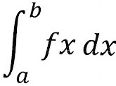

#Mi History

Mi primer aprendizaje con git

Aumentando mas codigo

cambiando mi codigo

Primera mente vario variables

imagen 2

varios cambios a mi proyecto
esto es para revisar lo anterior dicho

